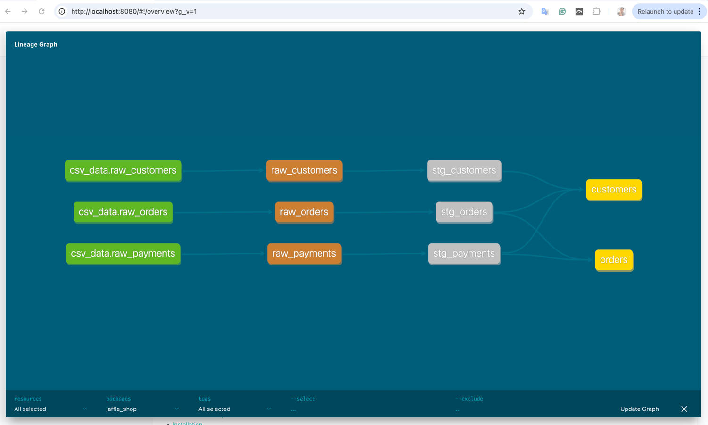
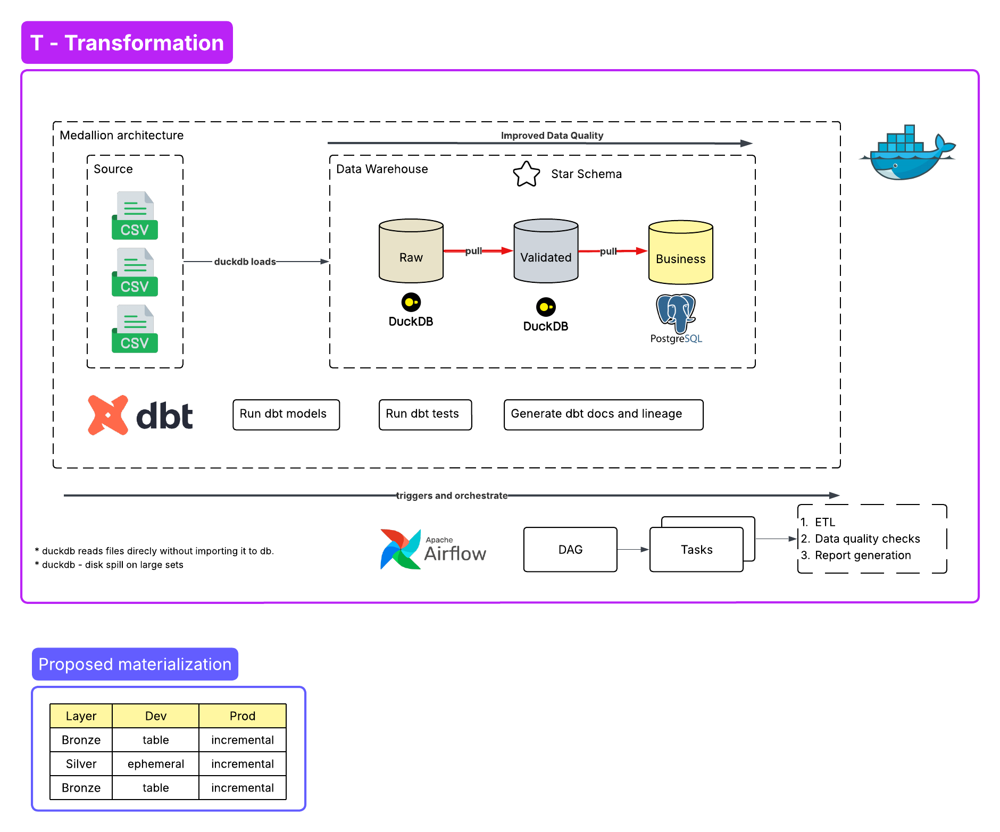
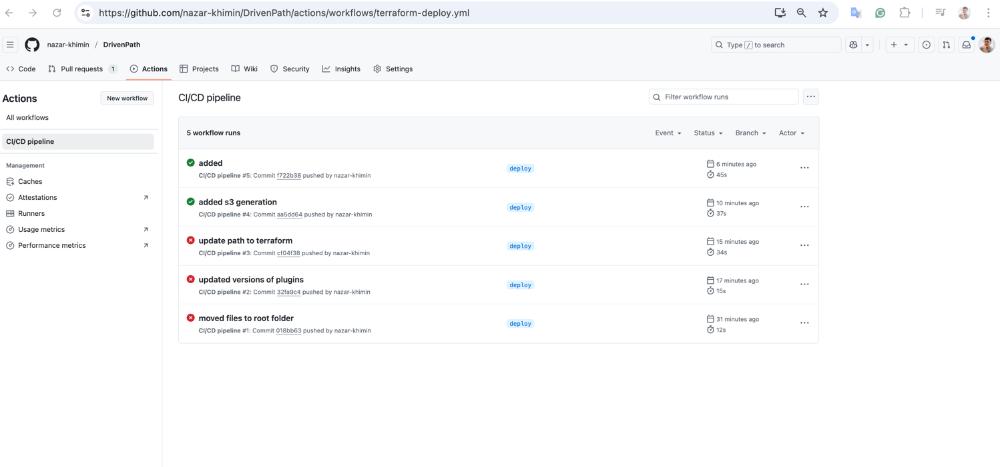

## Overview

This repository contains **prototypes** related to data engineering.

## 📂 Topics

- 🌀 [Airflow](https://github.com/nazar-khimin/data_misc/tree/main/airflow) – ETL workflows using Airflow 3.0.0
- 🧩 [Extended jaffle_shop_duckdb dbt playground](https://github.com/nazar-khimin/data_misc/tree/main/dbt/jaffle_shop_duckdb) – Runs dbt with DuckDB inside a Docker container
- ☁️ [AWS](https://github.com/nazar-khimin/data_misc/tree/main/aws) 
  - 🔧 **ETL Pipeline using AWS Glue** – Transformations with Glue Jobs, storage in S3/Data Catalog, and querying with Athena
  - ⚙️ **Automate AWS resource creation** – Terraform provisioning of S3 triggered by GitHub Actions
- ⚡️ [Kafka Consumer/Producer](https://github.com/nazar-khimin/data_misc/tree/main/kafka) – Publishes to and consumes from Kafka topics, persisting messages into PostgreSQL

## Sub-projects

**1.Airflow**  
ETL workflows processing data across Bronze, Silver, and Golden layers using Airflow 3.0.0.

**2. Extended jaffle_shop_duckdb dbt playground**

This project runs dbt with DuckDB inside a Docker container, without using dbt seed to load raw data. Instead, raw CSV files are loaded via SQL models as real DuckDB tables. The setup avoids unnecessary DB objects and keeps everything lightweight and local.

**3. AWS**

**3.1 ETL Pipeline using AWS Glue**

## AWS Services:
1. Amazon S3
2. AWS MWAA
3. AWS Glue Crawlers
4. AWS Glue Data Catalog
5. IAM
6. CloudWatch Logs
7. Amazon Athena

## 🧰 Tools & Technologies
1. Python
2. Terraform

## ⚙️ DAG Description

- Generate synthetic data  
- Store the data in an **S3**
- Scan data data in S3  
- Extract and register schema metadata using **Glue Crawler**
- Apply necessary transformations using AWS Glue Job
- Store data in S3 and metadata in **Glue Data Catalog**
- Query using **Athena**  

https://github.com/user-attachments/assets/b504542d-b802-4871-9632-86d5b61f80d0

**3.2 Automate AWS Resource creation using Terraform with GitHub Actions**

**4. Kafka Consumer/Producer with saving to Postqresql**

https://github.com/user-attachments/assets/5d1d1786-bfb4-4e5d-aec0-03fddad0986d