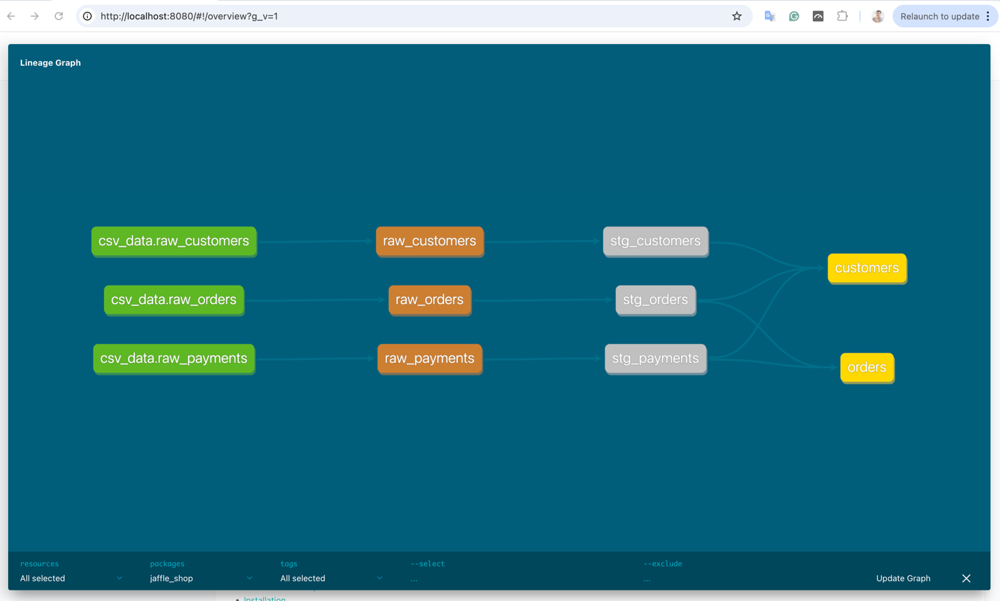

# Data Engineering Lab: Airflow, dbt, DuckDB, Kafka, AWS Glue

Practical data engineering projects covering local and cloud pipelines: Airflow orchestration, dbt transformations, DuckDB/PostgreSQL storage, Kafka ingestion, AWS Glue/MWAA infrastructure, Terraform provisioning, and SCD Type 2 modeling.

This repository is a portfolio lab, not one production application. Each module focuses on a specific data engineering pattern and keeps runnable examples, screenshots, or infrastructure code close to the implementation.

## Modules

| Module | Focus | Stack | Link |
|---|---|---|---|
| Airflow + dbt PII pipeline | Bronze/Silver/Golden orchestration, PII/domain separation, synthetic data generation | Airflow 3.0, dbt, DuckDB, PostgreSQL, Python, Faker | [airflow/pii](airflow/pii) |
| dbt + DuckDB mart modeling | Local analytics pipeline without `dbt seed`; raw CSV → staging → marts | dbt, DuckDB, Docker, SQL | [dbt/jaffle_shop_duckdb](dbt/jaffle_shop_duckdb) |
| AWS Glue / MWAA pipeline | Cloud ETL infrastructure, schema discovery, cataloging, querying | S3, MWAA, Glue Crawlers, Glue Jobs, Data Catalog, Athena, IAM, CloudWatch, Terraform | [aws/Glue ETL](aws/Glue%20ETL) |
| Kafka → PostgreSQL streaming | Producer/consumer flow persisting streamed messages into PostgreSQL | Kafka, PostgreSQL, Python, Docker Compose | [kafka](kafka) |
| SCD Type 2 modeling | Slowly changing dimension modeling and inspection UI | SQL, DuckDB, Streamlit, Python | [sql_scd_type_2](sql_scd_type_2) |

## Architecture patterns covered

- **Orchestration:** Airflow DAGs with task groups and dbt execution stages.
- **Layered modeling:** Bronze, Silver, and Golden data layers.
- **Local analytics:** DuckDB-based pipelines for lightweight development.
- **Warehouse modeling:** staging models, dimensional marts, SCD Type 2 examples.
- **Streaming ingestion:** Kafka producer/consumer flow with PostgreSQL persistence.
- **Cloud data platform:** AWS S3, MWAA, Glue, Data Catalog, Athena, IAM, CloudWatch.
- **Infrastructure as code:** Terraform modules for AWS data infrastructure.
- **Data quality direction:** schema separation, dbt model structure, PII/domain-specific outputs.

## Main projects

### 1. Airflow + dbt PII pipeline

ETL workflow that generates synthetic PII/network/finance data, loads it through Bronze and Silver layers, and produces Golden outputs split by domain.

Highlights:

- Airflow 3.0 DAG with explicit generation → dbt Bronze → dbt Silver → dbt Golden flow.
- Synthetic data generator with Faker for repeatable local experimentation.
- DuckDB used for local Bronze/Silver storage and PostgreSQL for Golden outputs.
- dbt models separate PII, payment, technical, and non-PII datasets.


Path: [airflow/pii](airflow/pii)

### 2. dbt + DuckDB local analytics pipeline

Dockerized dbt project using DuckDB without `dbt seed`. Raw CSV files are loaded as real DuckDB tables, transformed through staging views, and materialized into marts.

Highlights:

- Local Docker-based dbt execution.
- Raw CSV → staging → mart modeling flow.
- DuckDB `read_csv_auto` ingestion instead of seed tables.
- Lineage and component documentation included.



Path: [dbt/jaffle_shop_duckdb](dbt/jaffle_shop_duckdb)

### 3. AWS Glue / MWAA / Terraform pipeline

Cloud ETL prototype that provisions AWS data infrastructure and runs a managed data pipeline.

Flow:

1. Generate synthetic data.
2. Store raw data in S3.
3. Scan data in S3 with Glue Crawlers.
4. Register metadata in AWS Glue Data Catalog.
5. Transform data with AWS Glue Jobs.
6. Query cataloged data with Athena.
7. Monitor execution through CloudWatch Logs.

AWS services:

- Amazon S3
- AWS MWAA
- AWS Glue Crawlers
- AWS Glue Jobs
- AWS Glue Data Catalog
- Amazon Athena
- IAM
- CloudWatch Logs


Path: [aws/Glue ETL](aws/Glue%20ETL)

### 4. Kafka → PostgreSQL streaming

Kafka producer/consumer example that publishes messages to Kafka topics and persists consumed events into PostgreSQL.

Highlights:

- Docker Compose setup for local streaming infrastructure.
- Python producer and consumer scripts.
- PostgreSQL schema/table creation scripts.

Path: [kafka](kafka)

### 5. SCD Type 2 modeling

SQL/DuckDB example for slowly changing dimension handling with a small Streamlit inspection app.

Highlights:

- SCD Type 2 data modeling practice.
- DuckDB local database.
- Streamlit UI for inspecting modeled data.

Path: [sql_scd_type_2](sql_scd_type_2)

## How to run

Each module has its own setup and commands. Start with these two if you are reviewing the repository:

### dbt + DuckDB

```bash
cd dbt/jaffle_shop_duckdb
docker-compose up
```

### Airflow + dbt PII pipeline

```bash
cd airflow/pii
docker compose build
docker compose up airflow-init
docker compose up
```

See module READMEs for detailed commands and screenshots.

## CV usage

Use this for Data Engineer / Data Quality Engineer roles:

> Built a modular data engineering lab covering Airflow/dbt orchestration, DuckDB/PostgreSQL transformations, Kafka ingestion, AWS Glue/MWAA infrastructure, and SCD Type 2 modeling.

Short version:

> Built Airflow/dbt/DuckDB data pipelines with Bronze/Silver/Golden layers, Kafka→PostgreSQL ingestion, and AWS Glue/MWAA infrastructure prototypes.

For Software Engineer / AI Product Engineer roles, compress it to one support bullet:

> Built data engineering prototypes with Airflow, dbt, DuckDB, Kafka, and AWS Glue to strengthen backend/data workflow experience.

## Current status

This is a learning and portfolio lab. The strongest parts are the architecture coverage and practical implementation breadth. The next improvements should be:

- Add dbt tests for key models.
- Add one end-to-end validation command per module.
- Add a single architecture diagram for the whole repository.
- Add sample output screenshots for Kafka/PostgreSQL and SCD Type 2 modules.
- Clean up module names and standardize README structure across folders.
