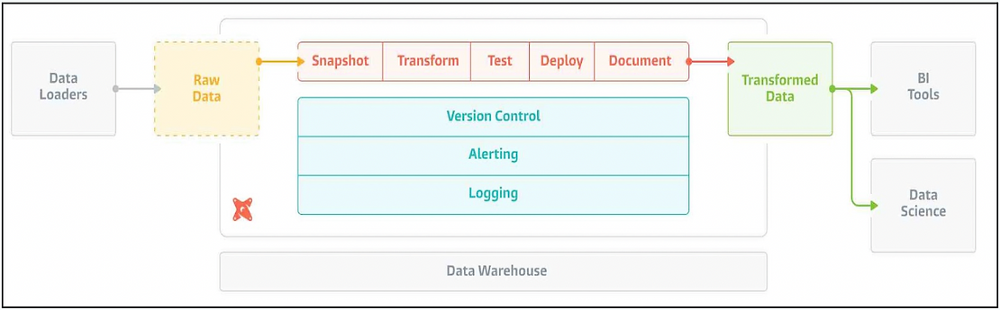
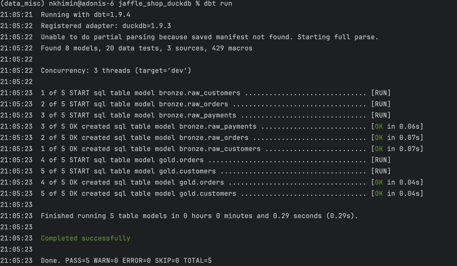

# 🦆 jaffle_shop_duckdb (Dockerized, No Seeds)

This project runs dbt with DuckDB inside a Docker container, **without using `dbt seed`** to load raw data. Instead, raw CSV files are loaded via SQL models as real DuckDB tables. The setup avoids unnecessary DB objects and keeps everything lightweight and local.




---

## ✅ Features

- Uses [xemuliam/dbt:duckdb](https://hub.docker.com/r/xemuliam/dbt) Docker image (no rebuild required)
- Loads raw CSV data via SQL, not `dbt seed`
- Keeps your DB clean (no extra artifacts)
- One-liner `dbt run` execution
- Everything runs **inside Docker** with **mounted volume**

---

## 🗂️ Project Structure

```
jaffle_shop_duckdb/
├── models/
│   ├── raw/              # Loads CSVs as DuckDB tables
│   ├── staging/          # Views that clean raw data
│   └── marts/            # Final models (tables)
├── data/                 # Local CSVs
│   ├── customers.csv
│   ├── orders.csv
│   └── payments.csv
├── dbt_project.yml
└── jaffle_shop.duckdb    # Local DuckDB file (auto-generated)
```

---

## 🚀 Run Everything

> ⚠️ Make sure you're in the root of the project folder before running this!
```bash
pip-compile requirements.in
```

```bash
docker-compose up
```

This will:

1. Load raw data from CSV into DuckDB **as tables**
2. Transform it through staging views
3. Build final models (e.g., `orders`, `customers`)

---

## 📄 How Raw CSVs Are Loaded

Each raw model (`models/raw/*.sql`) uses DuckDB’s `read_csv_auto` to **load data directly from the `/data` folder**, like this:

```sql
{{ config(materialized='table') }}

SELECT *
FROM read_csv_auto('data/customers.csv')
```

This skips the need for `dbt seed`.

---

## 🧼 Keep It Clean

- No extra documentation, tests, or seeds are used
- No need to rebuild Docker image
- Everything runs in a clean, disposable container

---

## 🧪 Inspect DB (optional)

To open the DuckDB file manually:

```bash
duckdb jaffle_shop.duckdb
```

Inside DuckDB:

```sql
.tables
```
---

```sql
SELECT table_name, table_type
FROM information_schema.tables
WHERE table_type = 'VIEW';
```

---

## 🙌 Notes

- Make sure your host machine has **Docker** and **DuckDB CLI** installed if you want to inspect manually.
- CSV files must be in the `data/` folder relative to the root.

## Console execution
