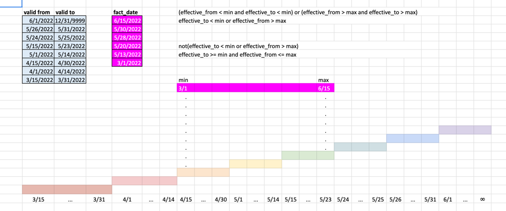
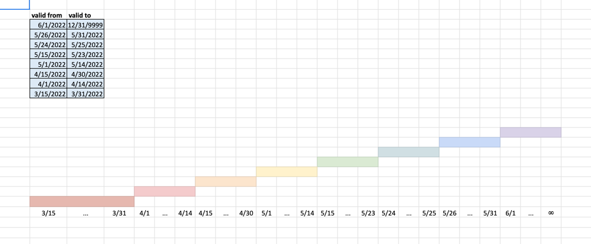
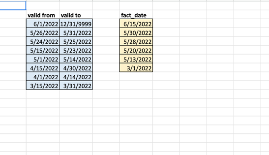
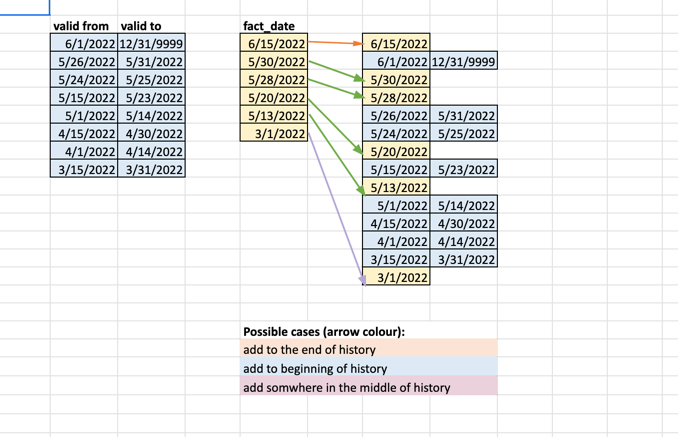
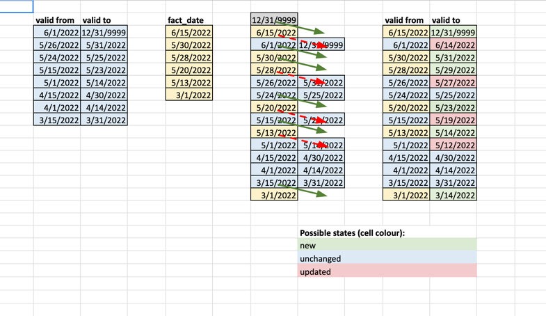

## What is Slowly Changing Dimension (SCD) Type 2?
SCD Type 2 is a common data warehousing technique used to track historical changes in dimensional data. Instead of overwriting old data when a dimension attribute changes, SCD Type 2:

Inserts a new row with the updated attribute and a new effective date range.

Keeps the old rows with their original date ranges.

Uses effective_from and effective_to dates (or timestamps) to maintain the validity period of each row version.

This allows full history tracking and enables queries on how dimension data looked at any point in time.


## SDC filtering concept
Key Filtering Logic:

Exclude records totally outside the fact date range:

```
(effective_from < min AND effective_to < min)
OR
(effective_from > max AND effective_to > max)
```

These records are outside the window of interest and can be ignored.

Focus only on records that overlap the fact date range:

```
NOT (effective_to < min OR effective_from > max)
This condition selects records that are valid at least partially during the fact date window.
```

More specifically, keep records where:

```
effective_to >= min
AND
effective_from <= max
```
Ensures that records are still active within the min-max fact date window.

```
min and max fact dates:
min = 3/1/2022
max = 6/15/2022
```
This filtering allows your SCD join or merge logic to only process relevant historical versions that align with the new facts' timeframe.



## Initial state

## New records

## Placement

## Hist State


## How to run streamlit app
```
streamlit run app.py
```